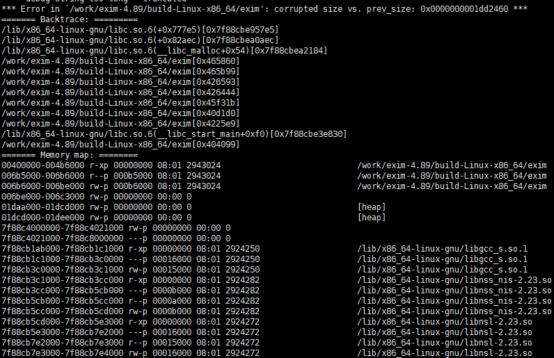

# CVE-2018-6789——Exim RCE Vulnerability

漏洞的成因是b64decode函数在对不规范的base64编码过的数据进行解码可能会溢出堆上的一个字节，比较经典的off-by-one漏洞。

存在漏洞的b64decode函数部分代码如下：

```c
b64decode(const uschar *code, uschar **ptr)
{
int x, y;
uschar *result = store_get(3*(Ustrlen(code)/4) + 1);

*ptr = result;

/* Each cycle of the loop handles a quantum of 4 input bytes. For the last
quantum this may decode to 1, 2, or 3 output bytes. */
 ......
}
```

运行docker启动exim服务：

```shell
docker run -it --name exim -p 25:25 skysider/vulndocker:cve-2018-6789
```

运行poc.py触发该漏洞：

```shell
# python poc.py
this poc is only tested in exim 4.89 x64 bit with cram-md5 authenticators
input ip address: 127.0.0.1
[!] exim server seems to be vulnerable to CVE-2018-6789.
```

当执行这段代码时，会触发内存错误



#### 更新

已添加针对该环境的exploit脚本，该脚本仅用于学习交流和研究目的，请勿用于非法用途。

#### 参考：

- https://www.exim.org/exim-html-current/doc/html/spec_html/ch-access_control_lists.html
- https://devco.re/blog/2018/03/06/exim-off-by-one-RCE-exploiting-CVE-2018-6789-en/

